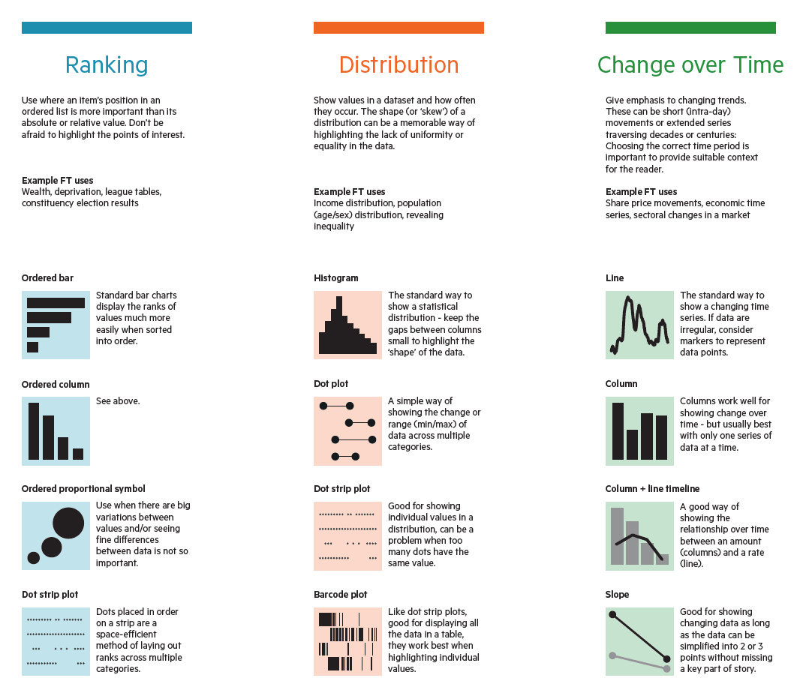

### submitted (pushed) to GitHub

**1. What is your previous R and programming experience (if any)?**

-   I taught myself Stata using a udemy course and googling, while I was a clinical trial coordinator, mainly for data wrangling and very basic data analysis.
- I started a grad cert at RMIT last year completing 2 intensive subjects (with a fabulous facilitator called Tam) in R and python (including jupyter and rmarkdown). I am slowly re-learning these.
- I'm slowly learning SAS in HDAT9400.

**2. A colleague comes to you and claims 'I always use a bar chart because it's always the best presentation format.' Is your colleague speaking sense? If so why is the statement right? If not how do you counter the argument?**

- While better than the infamous pie chart, I doubt the bar chart is always better.
- The advantage of bar charts - that are well labelled and have good data : aesthetics or ink ratios - is that comparison of counts or across categories can be made quickly.
- But bar charts are not good for showing a number of other data concepts, for example time (need a series of bar charts or timeline), geospatial data, clusters (eg scatterplot), distributions (a histogram or density plot) or proportions (a stacked bar might be).
- This is a [handy link](https://github.com/Financial-Times/chart-doctor/blob/main/visual-vocabulary/Visual-vocabulary-en.pdf) (excerpt shown) for countering such a comment from a colleague.

**3. When communicating it is very important to 'know your ...'? Finish this sentence.** 

- your audience *and*

- your data. 

**4. Why is an automated approach to data manipulation better than a manual approach? Why should we write code to manipulate data rather than do it by hand?**

The key benefit of writing code to manipulate data is that the method
can be scrutinised by others (or you at a later date, 'future you') and
can be repeated. This is fundamental to the scientific method. This you
means you (or others) can iterate and improve the approach.

**5. What does CRAN stand for and what is it?**

- Comprehensive R Archive Network (CRAN) is R's central software
    repository, supported by the R Foundation.
- It's main location is here -\> <https://CRAN.R-project.org/> and it is mirrored globally.
- It is the official place to download R and all the R packages.

**6. State one advantage to the literate programming approach?**

> *The report is the analysis and the analysis is the report.*

-   In literate programming (after Knuth) the goal is to tell the computer what to do **and** tell other humans what we are telling the computer to do.
-   The main advantage is the two (the report for humans and the analysis for the computer) are combined in one document and saves on copying from one to another and this makes changes and version control more straightforward.
-   RMarkdown and knitr are the key enabler for literate programming.